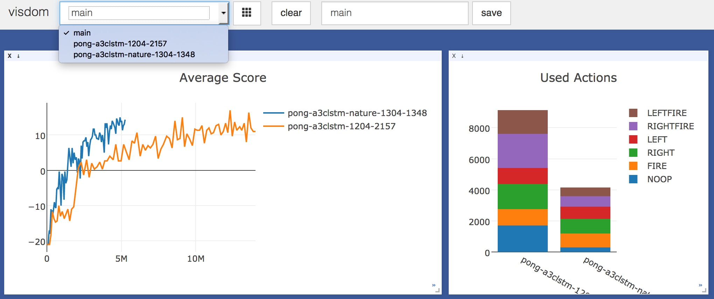
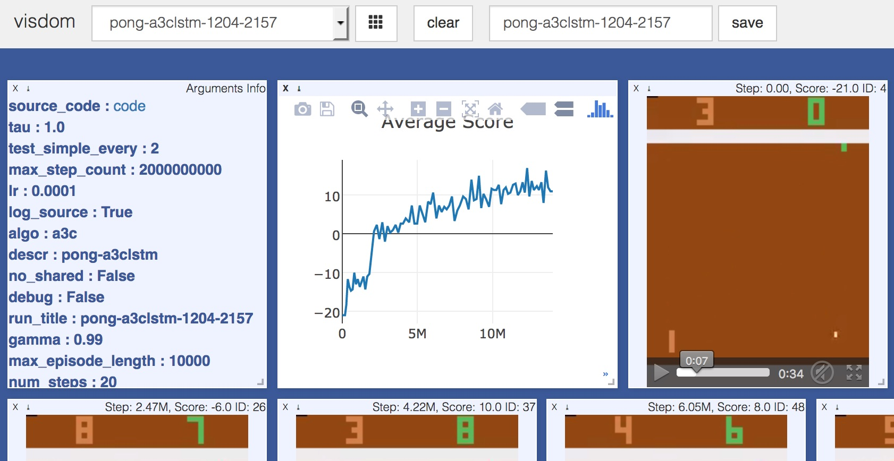

# Bombora
My ongoing experiments in RL, originally based on [ikostrikov/pytorch-a3c](https://github.com/ikostrikov/pytorch-a3c).


### Usage
```
OMP_NUM_THREADS=1 python main.py --env-name "KungFuMaster-v0" --algo a3c --num-processes 4
```


Note:
Pytorch is still in beta and non recent version might have some problems.
### Dashboard
Logs are stored in `dblogs` directory, to watch agents learn run:

```
python dashboard.py --dbdir dblogs --env 'KungFuMaster-v0'
```
This will start a visdom server and show the last 2 run logs in KungFuMaster-v0 env.


[video](https://www.youtube.com/watch?v=T8AQm_OynW0)

### Dependencies
   * pytorch
   * torchvision
   * gym
   * sqlite3
   * [visdom](https://github.com/facebookresearch/visdom)

### Credits

Cheers to [Pytorch](http://pytorch.org) and authors of the follwing repos:
   
   * [ikostrikov/pytorch-a3c](https://github.com/ikostrikov/pytorch-a3c)
   * [steveKapturowski/tensorflow-rl](https://github.com/steveKapturowski/tensorflow-rl)

